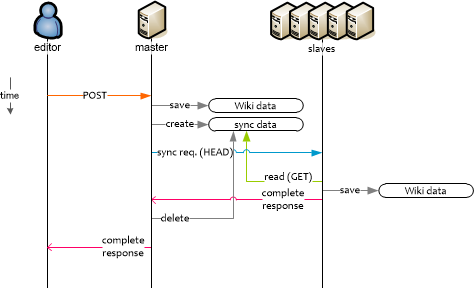

xpdk2
=====

PukiWiki Decentralization Kit

--------------------
 * INSTALLATION

 1. MASTER & SLAVES: edit xpdk2_config.php
 2. MASTER & SLAVES: copy xpdk2.php and xpdk2_config.php to PukiWiki/lib/
 3. MASTER: create and chmod(read write execute) XPDK2_DATAPATH directory
 4. MASTER & SLAVES: include xpdk2.php on the last of 'Include subroutines' in PukiWiki/lib/pukiwiki.php
> [sample]
> require_once( LIB_DIR . 'xpdk2.php' );
 5. MASTER: xpdk2_sync(TRUE); before page_write() in PukiWiki/plugin/edit.inc.php
> [sample]
> if( xpdk2_sync( TRUE ) )
> page_write( ... );
 6. SLAVE: disable digest check function in plugin_edit_write() in PukiWiki/plugin/edit.inc.php
 
